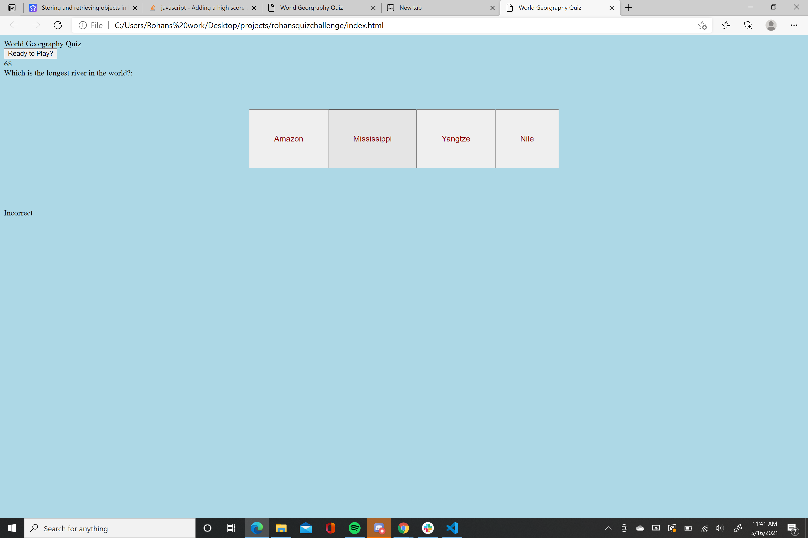
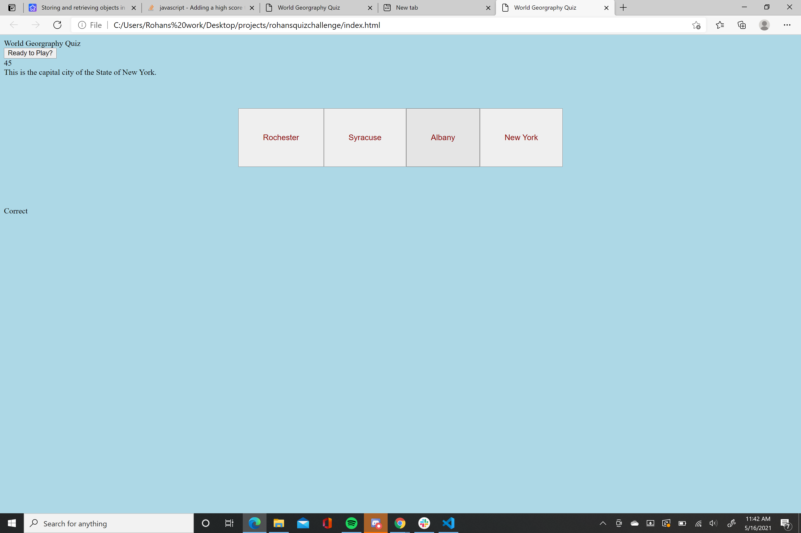
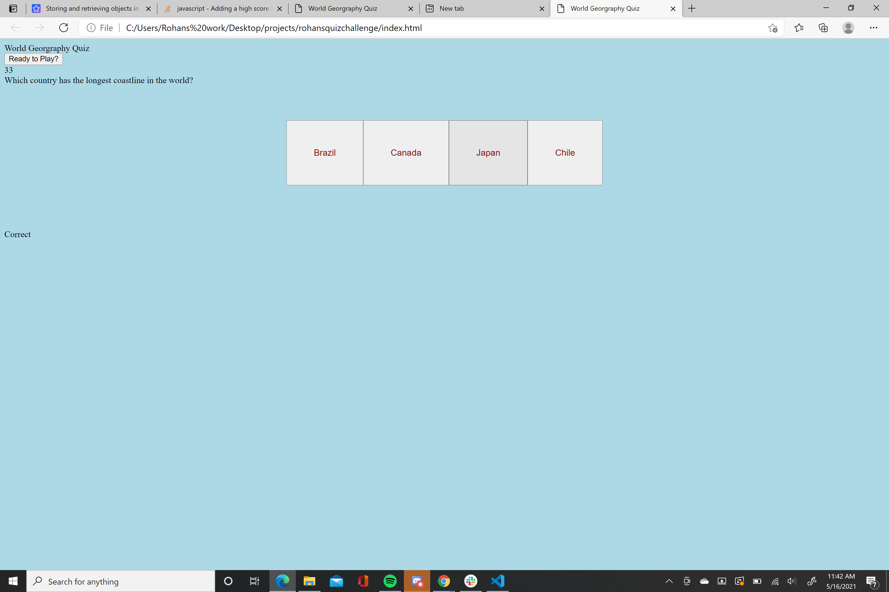

# rohansquizchallenge
We were tasked to create a quiz that would inform us if we chose an incorrect or correct answer, along with it including a timer that would reduce in time if we chose a incorrect answer.
I was able to create a responsive quiz that indicated if you chose a correct or incorrect answer. My quiz consisted of five question on the topic on world geography. My timer started at 100 seconds and went down by 15 seconds for every wrong answer. My quiz also gave you a score after the quiz was finished. The score could be as low as 0 or as high as five.  I was unable to create a high score list.

